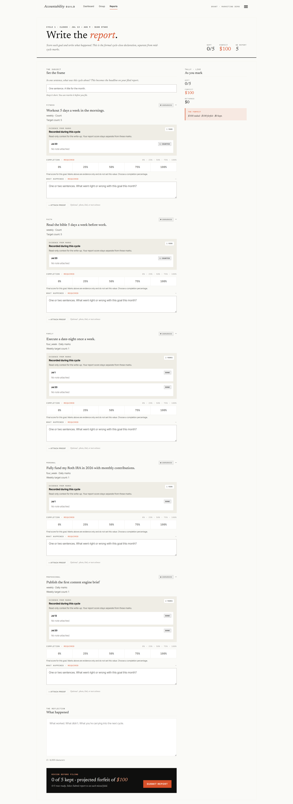
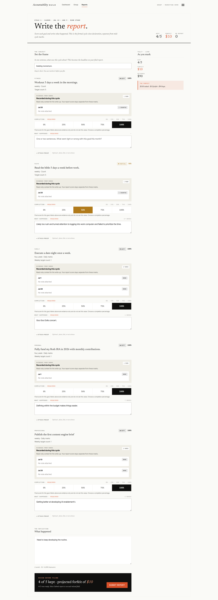

# UI reference — Cycle-close report view ("Write the report")

**Captured:** 2026-08-07, via screenshot pasted in-session (desktop width, full-page capture). Source images attached in `assets/` — see bottom of doc.

**Purpose:** reference for future creative asset creation (social cards, product screenshots in marketing pages, Field notes illustrations, ad creative) that wants to depict the app's cycle-close report flow authentically.

## What the view is

The report-writing screen a member fills out at cycle close (Act 3 of the [[core-mechanic]] — "Close with receipts"). Route is under `/reports`. Nav bar reads: Dashboard · Group · Reports, with a "Grant · Marketing Guide" utility link and hamburger menu top right.

## Page structure, top to bottom

**Masthead**
- Mono kicker row: `CYCLE 1 · CLOSED · JUL 13 – AUG 9 · $100 STAKE`
- Display headline: "Write the *report*." — serif, with "report" in italic ember, matching the brand's [[voice-and-tone]] register (semi-blunt, no humor) and the [[brand-standards]] display-H1 pattern (italic ember span within Newsreader serif).
- Lede: "Score each goal and write what happened. This is the formal cycle-close declaration, separate from mid-cycle marks." — italic serif, ink-soft, per the design system's lede spec.
- Top-right stat cluster: three mono-labeled stats — KEPT `0/5`, FORFEIT `$100` (ember), MO EFFORT `5`.

**Two-column layout below the masthead**

*Left column (main, wider) — one card per goal, repeated 5x:*
- Mono category kicker (FITNESS, FAITH, FAMILY, PERSONAL, PROFESSIONAL) with a small "ENHANCED" badge, top right of each card, and a collapse chevron.
- Goal title in serif ("Workout 5 days a week in the mornings.")
- Metadata line: cadence · type · target (e.g. "Weekly · Count", "Target count: 5").
- **Evidence panel** (bordered, tinted background, read-only): "EVIDENCE FROM MARKS — Recorded during this cycle. Read-only context for the write-up. Your report score stays separate from these marks." Lists dated entries (e.g. "Jul 20") each with a mark-type chip (1 CREATED, 1 MARK, 1 DONE, DONE) and "No note attached" placeholder text. Some goals show multiple dated rows (multi-mark goals like the date-night and Roth IRA goals).
- **Completion selector**: five-button segmented control — 0% · 25% · 50% · 75% · 100% — labeled "COMPLETION · REQUIRED" in mono/ember (required fields flagged in ember). Helper italic line: "Final score. Marks above are evidence only and do not set this value. Choose a completion percentage."
- **Reflection textarea**: "WHAT HAPPENED · REQUIRED" mono label, placeholder "One or two sentences. What went right or wrong with this goal this month?"
- "+ Attach proof" ghost link with "Optional · photo, link, or voice memo" helper text.

*Right column (narrow sidebar, sticky):*
- "TALLY · LIVE" mono header, "As you mark" subheading.
- Stat stack: KEPT `0/5`, FORFEIT `$100` (ember), RETURNS `$0`.
- Ember-tinted callout box: "THE FORFEIT — $100 staked · $100 forfeit · $0 buys." (bordered panel, ember-soft fill, editorial-alert styling rather than a generic warning banner)

**Below the goal cards**
- "THE REFLECTION" section: "What happened" serif head, large open textarea ("What worked. What didn't. What you're carrying into the next cycle."), character counter bottom-left ("0 / 4,000 characters").

**Sticky footer bar (black background, full width)**
- Left: small ember kicker "REVIEW BEFORE FILING", then large line "0 of 5 kept · projected forfeit of *$100*" (forfeit amount in ember italic).
- Sub-line: "0/5 marks ready. Select Submit report to see each missed field." (italic, muted)
- Right: ember-filled "SUBMIT REPORT" button (primary CTA, sharp corners, tracked caps per button-label spec).

## Design-system callouts (matches ratified [[brand-standards]] / [[design-system]])

- Sharp corners throughout (radius 0) — no rounded cards except stat/status chips.
- Mono JetBrains-style labels for every field/section header, tracked caps, small size — matches "mono is always small, tracked, uppercase" rule.
- Ember used as punctuation only: required-field labels, forfeit dollar amounts, the italic word in the H1, the primary CTA fill. No large ember fields except the CTA and the forfeit callout box — consistent with "ember is punctuation, not paint."
- Editorial voice in helper copy — full sentences, italic serif, no jargon, no emoji, matches [[voice-and-tone]].
- Two-tier information hierarchy: mid-cycle "marks" (read-only evidence) vs. the cycle-close "report" (the actual score/reflection) are visually separated — evidence panel is boxed and muted, the scoring controls are the active/required elements. Useful detail for any creative asset trying to explain "how AG works" — marks ≠ report.

## For creative asset use

Good candidate source for:
- Product-screenshot social cards illustrating "what closing a cycle looks like"
- Explainer graphics for the goal-setting/reporting guide articles in `docs/research`
- Any asset that needs to show the forfeit mechanic concretely ($100 staked, $0 returned when nothing's kept) — ties directly to the pooled-kitty mechanic in the top-level [[README]]/product overview.

## Example: completed report (filled state)

Second capture, 2026-08-07, same view and same cycle (`CYCLE 1 · CLOSED · JUL 13 – AUG 9 · $100 STAKE`) after a member has scored all five goals and written their reflections. Useful as the "after" counterpart to the blank state above — shows what real data/copy density looks like in each element.

**Header stats now read:** KEPT `4/5`, FORFEIT `$10`, MO EFFORT `0`. Sidebar tally mirrors this: KEPT `4/5`, FORFEIT `$10`, RETURNS `$90`. Forfeit callout box updates to "$100 staked · $10 forfeit · $90 buys."

**"Set the frame" field** (top, previously blank) is filled in: "Building momentum."

**Per-goal status badges and completion-selector fill color are state-coded** — this is the key new detail not visible in the blank state:
- **Kept (100%)** — badge reads "● KEPT" in a solid dark/ink pill; the "100%" button in that goal's completion segmented control is filled solid ink/black with white text. Four of the five goals (Fitness, Family, Personal, Professional) are in this state.
- **Partial (50%)** — badge reads "● PARTIAL" and the percentage is shown in a warm amber/gold tone; the "50%" segmented-control button is filled solid amber/gold (a distinct warning-style color, not the brand ember-red) with white text. Only the Faith goal ("Read the bible 5 days a week before work") is in this state in this example.
- This confirms the app UI layer uses its extended functional palette (state pairs beyond the seven brand tokens — see [[design-system]] §"App UI") for kept/partial/(presumably missed) status, not just ember.

**Reflection textareas are filled per goal**, showing realistic copy length/tone (short, first-person, unpolished, sentence-fragment style — useful for mocking up realistic placeholder copy in future assets):
- Fitness: left blank even though kept (100% doesn't force a written reflection in this example — worth confirming if that's a validation gap or intentional).
- Faith (partial): "Likely too rush and turned attention to logging into work computer and failed to prioritize the time."
- Family: "Goo Goo Dolls concert."
- Personal: "Defining within the budget makes things easier."
- Professional: "Getting better at developing AI enablement's"
- Overall "What happened" reflection at the bottom: "Need to keep developing the routine."

**Footer bar copy adjusts for the filled state:** "4 of 5 kept · projected forfeit of $10" with sub-line "4/5 were ready. Select Submit report to see each missed field." — note the sub-line pluralization/wording tracks the ready-count, distinct from the blank state's "0/5 marks ready."

## Image attachment

Both screenshots are saved in `docs/product/ui-references/assets/`:
- `cycle-close-report-view-blank.png` — empty/unstarted report (first capture)
- `cycle-close-report-view-completed.png` — filled report, 4/5 kept (second capture)
